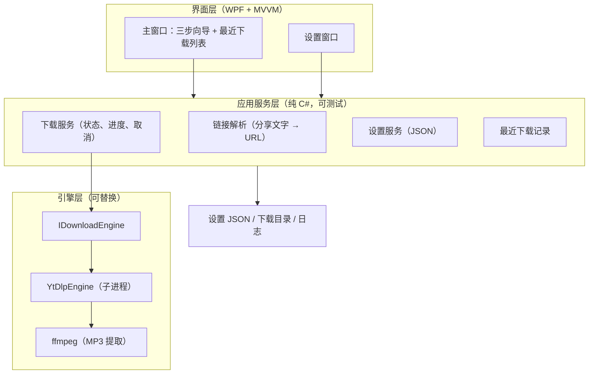

# DouyiDownloadUI 设计文档（需求规格）

> 日期：2026-08-02
> 状态：需求分析与设计已确认，等待用户审阅本规格
> 项目记忆：`AGENTS.md`（决策记录以项目记忆为准）

## 1. 项目概述

**一句话描述**：一个面向"有一定电脑水平的操作者"的 Windows 桌面软件，从抖音下载视频（MP4）或只下载音频（MP3），文件命名可控、按序号排序，最终由操作者手动拷贝到 U 盘。

**项目性质**：学生单人学习项目。核心目标不是功能多，而是完整走一遍专业软件开发流程：需求 → 设计 → 计划 → 实现（TDD）→ 评审 → 发布 → 打包。

**目标用户**：操作者本人（可能是学生本人，也可能是会用电脑的长辈）。操作者能完成复制粘贴、鼠标选字等基本操作；软件要"简洁清晰、步骤少、容错高"，但不需要零基础教学式文案。

## 2. 需求清单

### 2.1 功能需求

| 编号 | 需求 |
| --- | --- |
| FR1 | **链接获取**：打开软件或切回窗口时，自动识别剪贴板中的抖音"分享口令"整段文字并填入输入框；也支持手动粘贴整段文字。软件透明地从中提取视频 URL，操作者不需要理解"链接"概念。 |
| FR2 | **确认文件名**：进入第②步后，显示 编号 / 类型 / 标题 三个可编辑字段。原标题完整展示在可滚动区域，操作者用鼠标选中文字后自动填入"文件名"输入框，并可继续手动修改。 |
| FR3 | **编号规则**：编号输入框可编辑；默认值优先级：①目标文件夹现有文件最大编号 + 1（只认文件名开头的数字）→ ②上次记忆编号 + 1 → ③ 1。每次下载完成后记忆本次编号。 |
| FR4 | **类型字段**：可编辑文本框，记忆常用类型供点选（中三、中四、平四、三步等），不预置固定列表。 |
| FR5 | **下载视频**：保存为 MP4，原样保存，不做压缩/转格式。 |
| FR6 | **下载音频**：同一视频转成 MP3（使用 ffmpeg）。 |
| FR7 | **保存位置**：可选择文件夹并记住上次选择；默认建议本地文件夹（不默认 U 盘）。 |
| FR8 | **进度与结果**：第②步内显示进度条与百分比；完成进入第③步；失败显示大白话提示 + 可重试。下载中可取消，取消后清理临时文件。 |
| FR9 | **导出流程**：完成页提供"打开文件夹"主按钮和"再下载一个"次按钮；主窗口底部常驻"最近下载"列表（点击可定位文件），随时可打开下载文件夹，操作者自行把文件拖到 U 盘。 |
| FR10 | **设置页**：保存位置（显示路径 + 更改）、字体大小（标准/大/特大）、疑难解答（日志、引擎版本、检查更新）、关于（版本、开源许可声明）。 |
| FR11 | **文件名去重**：目标文件夹已有同号文件时自动追加"（2）"，仍有冲突则依次"（3）""（4）"递增，绝不覆盖已有文件。 |

### 2.2 非功能需求

- **性能**：启动快（几秒内）、平时内存占用低；yt-dlp 只在下载时启动。适配性能一般的 Win10 机器。
- **可用性**：大字、大按钮；核心流程三步（粘贴链接 → 确认名字 → 完成）；全中文界面。
- **美观**：界面风格统一、大方；配色、字体、间距、按钮样式一致。
- **可靠性**：失败不崩溃、可重试、可恢复；全程日志，按日期滚动保留 30 天。
- **文案原则**：面向"有一定电脑水平的操作者"；错误提示直接说明原因；全软件不出现"家人"等第三方角色。

### 2.3 约束

- 仅支持 Windows 10 x64。
- 下载时需要联网。
- yt-dlp 与 ffmpeg 随安装包内置，用户无需自行安装任何东西。
- 安装包内附 yt-dlp（Unlicense）与 ffmpeg（GPL）许可证声明。

### 2.4 范围外（v1 不做）

- 视频压缩、转格式、剪辑；不提供"去水印"承诺。
- 下载队列（一次只下载一个，完成后可连续下载；编号自动接力）。
- 软件内文件管理列表（排序靠文件名序号，不做内置文件浏览器）。
- 自动静默更新（v1 只做"发现新版本 → 提示下载新安装包"）。
- UI 自动化测试（v1 用手动测试清单；FlaUI/WinAppDriver 为 v2 候选）。
- 代码签名（v1 不签名；购买证书/自签名列为后续可选项）。

### 2.5 成功标准

1. 操作者能不求助地完成：复制分享文字 → 打开软件 → 下一步 → 圈字/确认名字 → 下载视频或音频 → 打开文件夹 → 拖到 U 盘。
2. GitHub 仓库完整：规范提交、测试全绿、CI/CD 自动产出安装包、有语义化版本 Release 与 CHANGELOG。
3. 学习者能讲清流程每个环节为什么存在。

## 3. 总体架构

- 界面层只做显示与输入，不含业务逻辑（MVVM）。
- 应用服务层不依赖界面与网络之外的第三方，全部可单元测试。
- 引擎层通过 `IDownloadEngine` 接口隔离，yt-dlp 可替换、可加备用引擎。
- 本地文件：设置存 JSON；日志按日期滚动保留 30 天。

## 4. 核心流程

1. **启动**：快速启动，读取设置；检查剪贴板，若含抖音分享文字则自动填入输入框。
2. **第①步 粘贴链接**：输入框接受整段分享文字；识别成功显示绿色"✓ 已识别到抖音视频"，否则"下一步"置灰并提示重新复制。
3. **第②步 确认名字**：软件先解析视频元数据（仅取标题，不下载）；展示 编号/类型/标题 三字段；原标题可滚动、鼠标圈字自动填入文件名框；两个大按钮：「下载视频」（MP4）与「下载音频」（MP3）。若内容为图文作品（aweme_type=2），「下载视频」按钮置灰并显示提示「这是图文作品，只有背景音乐可下载」；「下载音频」下载背景音乐 MP3（直接流式下载，无需 ffmpeg 转换）。
4. **下载中**：按钮下方显示进度条与百分比；可取消；取消清理 `.part` 临时文件。
5. **第③步 完成**：绿色对勾 + 文件名；「打开文件夹」主按钮、「再下载一个」次按钮；最近下载列表置顶显示"刚刚"。
6. **连续下载**：一次一个；下一个命名窗口默认建议"上次编号 + 1"（若文件夹有文件则按文件夹最大编号 + 1）。

## 5. 界面设计（已确认）

- **主窗口**：顶部步骤指示（① 粘贴链接 → ② 确认名字 → ③ 完成），主区域随步骤切换；底部常驻"最近下载"列表与"打开下载文件夹"按钮。
- **命名步**：编号/类型/标题三字段；原标题区支持鼠标圈字自动填入；两个并排大按钮（下载视频/下载音频）；取消为角落小字链接。
- **完成页**：大对勾 + "下载完成！" + 文件名 + 两个按钮；列表最新项置顶。
- **设置页**：保存位置、字体大小、疑难解答、关于四个分区；左上角返回。
- 全软件不使用"家人"表述；提示语面向有一定电脑水平的操作者。

## 6. 错误处理与容错

| 场景 | 提示文案 | 操作 |
| --- | --- | --- |
| 粘贴内容无抖音链接 | 没有找到抖音视频，请重新复制 | 返回第①步 |
| 网络不通 | 网络好像不太通，检查一下网络再试 | 重试 |
| 视频不可下载（删除/私密） | 这个视频下载不了（可能已删除或设置了私密） | 返回第①步换一个 |
| 图文作品下载视频 | 这是图文作品，只有背景音乐可下载 | 「下载视频」按钮置灰，点「下载音频」 |
| 保存位置打不开 | 保存的位置打不开，请检查文件夹是否存在 | 去设置页改位置 |
| 下载引擎异常 | 下载引擎异常（yt-dlp 出错） | 去疑难解答看日志 |
| 软件崩溃 | 弹窗：软件遇到问题，日志已保存 | 一键打开日志 |

- 日志记录操作步骤、链接、引擎输出、错误堆栈；按日期滚动保留 30 天。
- 失败后提供"再试一次"，不做自动无限重试。
- 疑难解答页支持一键复制诊断信息，方便远程协助。

## 7. 测试策略

**测试金字塔**：大量单元测试 + 少量集成测试 + 发布前手动清单。

### 7.1 单元测试（xUnit）

- 链接解析：分享口令整段文字 → URL；无链接；短/长链接。
- 文件名生成：非法字符清洗、超长截断、`序号 类型 标题` 格式、空标题兜底、重名"（2）"。
- 编号规则：三级默认值优先级；记忆持久化。
- 设置服务：保存/加载/损坏配置文件回退默认值。
- 进度解析：yt-dlp 进度 JSON（百分比/速度/ETA）。
- 命令构造：视频 vs 音频（`--extract-audio --audio-format mp3`）参数正确。
- ViewModel：步骤状态流转、错误状态、取消行为。

### 7.2 集成测试

- 假引擎（输出固定内容的脚本）测试进程启动、输出读取、超时、取消。
- 真实抖音下载不放入自动测试；作为发布前手动冒烟测试。

### 7.3 手动测试清单（发布前）

复制分享文字 → 下载视频 → 下载音频 → 取消 → 断网 → 错误提示 → 安装包安装/卸载 → 打开文件夹 → 重名场景。

### 7.4 TDD 工作方式

核心模块先写测试（红）→ 最小实现（绿）→ 重构。CI 每次提交自动跑 `dotnet test`，全绿才允许合并。

## 8. 工程流程

### 8.1 版本控制

- `git init` 已完成；GitHub 仓库（建议公开）。
- 分支：trunk-based；`feat/xxx` 分支 + PR 合并回 `main`。
- 提交规范：Conventional Commits（`feat:` `fix:` `test:` `docs:` `ci:`）。

### 8.2 CI/CD（GitHub Actions）

- 工作流一（push/PR）：构建 + 测试 + 格式检查。
- 工作流二（tag `v*`）：Release 构建 → 下载固定版本 yt-dlp/ffmpeg → Inno Setup 生成安装包 → 发布 GitHub Release。

### 8.3 Release 与打包

- 语义化版本：`1.0.0` 起步；`CHANGELOG.md` 手写维护。
- Inno Setup：欢迎页、许可、安装目录、桌面快捷方式、卸载程序；内置引擎与许可文件。
- 代码签名：v1 不签名，文档说明 SmartScreen 提示的应对。
- 更新：启动检查 GitHub Releases，提示下载新安装包；自动更新留 v2。

## 9. 学习计划与里程碑

| 阶段 | 内容 | 学习点 |
| --- | --- | --- |
| 0 | 初始化：git、GitHub、README、.gitignore | 仓库卫生、首次提交 |
| 1 | 核心逻辑 TDD：链接解析、文件名、编号、设置 | TDD 红绿重构、单元测试 |
| 2 | 引擎封装：yt-dlp 子进程、进度解析、假引擎集成测试 | 进程边界、可替换接口 |
| 3 | WPF 界面：三步流程 + 列表 + 设置页 | XAML、MVVM、绑定 |
| 4 | 打磨：错误处理、日志、字体、美观 | 容错设计、UX 细节 |
| 5 | CI/CD：GitHub Actions 双工作流 | 自动化门禁 |
| 6 | 打包发布：Inno Setup、v1.0.0 Release | 语义化版本、分发 |
| 7 | 收尾：代码评审、手动测试清单、复盘 | 评审文化、验收 |

每阶段结束有学习检查点：学习者能讲清"为什么这样做"；开发过程包含代码评审。

## 10. 关键决策记录（摘要）

详见 `AGENTS.md` 决策记录。要点：WPF/.NET 技术栈；yt-dlp 引擎（曾评估 Evil0ctal/Douyin_TikTok_Download_API，因 Cookie 维护成本放弃）；`序号 类型 标题` 命名；编号三级默认值；向导 + 列表结合的界面；全 UI 无"家人"表述。

## 11. v2 候选

- 自动静默更新。
- 备用引擎（yt-dlp 已在主引擎位置，可扩展多引擎自动切换）。
- UI 自动化测试（FlaUI/WinAppDriver）。
- 代码签名。
